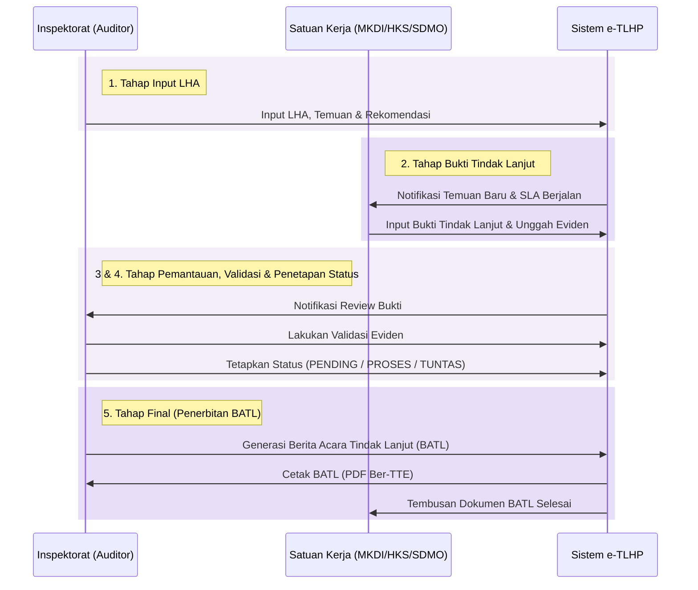

# Konsep Arsitektur dan Peta Jalan Sistem e-TLHP Kemenko Pangan

Dokumen ini menyusun konsep matang dan rekomendasi implementasi wajib agar prototipe sistem **e-TLHP** layak diproduksi (*Go Live*) sebagai sistem pemantauan yang aman, *scalable*, dan sesuai standar tata kelola pemerintahan di Kemenko Bidang Pangan.

---

## 1. Alur Kerja Kolaboratif Berdasarkan Proses Bisnis Kemenko Pangan

Sistem e-TLHP dirancang mengikuti proses bisnis resmi tim auditor Inspektorat Jenderal Kemenko Pangan yang terdiri atas 5 tahap utama:

1. **Input LHA (Laporan Hasil Audit)**: Auditor dari Inspektorat Jenderal melakukan input dokumen LHA, termasuk rincian temuan dan rekomendasi tindak lanjut ke dalam sistem.
2. **Input Bukti Tindak Lanjut**: Satuan Kerja (seperti **MKDI, HKS, SDMO**) mengakses sistem untuk melihat rekomendasi yang ditujukan kepada mereka, lalu mengunggah rencana aksi serta berkas bukti dukung (*eviden*).
3. **Pemantauan & Validasi**: Auditor melakukan monitoring secara berkala dan memvalidasi berkas bukti tindak lanjut yang telah diunggah oleh Satuan Kerja.
4. **Penetapan Status**: Berdasarkan hasil validasi bukti dukung, Auditor menetapkan status rekomendasi menjadi salah satu dari tiga status resmi:
   * **PENDING**: Belum ditindaklanjuti.
   * **PROSES**: Sedang dalam proses tindak lanjut (bukti dukung belum lengkap/sedang direview).
   * **TUNTAS**: Tindak lanjut telah selesai dan dinyatakan sesuai rekomendasi.
5. **Penerbitan Berita Acara Tindak Lanjut (BATL)**: Tahap akhir di mana Auditor menerbitkan dokumen BATL resmi yang digenerasi secara otomatis oleh sistem sebagai bukti hukum penutupan tindak lanjut LHA.



---

## 2. Fitur Wajib Go-Live (Must-Have Features)

### A. Role-Based Access Control (RBAC) & Single Sign-On (SSO)
Pembagian hak akses yang ketat sangat penting karena data LHA dan temuan bersifat rahasia:
* **Auditor (Inspektorat Jenderal)**: Hak penuh untuk input LHA, membuat temuan/rekomendasi, memvalidasi bukti tindak lanjut, menetapkan status rekomendasi, serta menandatangani & menerbitkan dokumen BATL.
* **Satuan Kerja (MKDI, HKS, SDMO, dll.)**: Hak akses terbatas. Hanya bisa melihat rekomendasi yang ditugaskan kepada unit kerja mereka, mengunggah berkas bukti tindak lanjut (*eviden*), menulis rencana aksi, dan melihat tanggapan review dari auditor.
* **Eksekutif (Menko / Sesmenko)**: Hak akses khusus *Executive Dashboard* untuk memantau ringkasan status penyelesaian agregat di seluruh Satuan Kerja secara makro tanpa perlu mengedit data LHA.
* **Integrasi SSO**: Integrasi dengan Layanan Single Sign-On Kemenko Pangan untuk kemudahan manajemen otentikasi akun pegawai.

### B. Modul Bukti Tindak Lanjut & Validasi Keuangan
Sistem memverifikasi bukti fisik penyelesaian rekomendasi secara digital:
* **Unggah Eviden**: Pengunggahan berkas bukti (PDF/Gambar) dengan batasan ukuran file, pemindaian virus otomatis, dan penyimpanan yang aman terenkripsi.
* **Integrasi Data Setoran Negara (NTPN)**: Khusus untuk rekomendasi temuan keuangan Inspektorat, Satuan Kerja wajib memasukkan Nomor Transaksi Penerimaan Negara (NTPN) dan mengunggah bukti setoran bank yang akan divalidasi kebenarannya oleh auditor.

### C. Audit Trail (Log Aktivitas Sistem)
Setiap tindakan di dalam sistem dicatat secara permanen untuk kepatuhan hukum (*legal compliance*):
* Sistem mencatat: **Identitas Pengguna** (Nama/NIP & IP Address), **Waktu Kejadian** (Timestamp presisi), **Tindakan** (Aksi: input LHA, unggah bukti tindak lanjut, ubah status), dan **Riwayat Nilai** (*old value* vs *new value*).
* Log aktivitas bersifat *Read-Only* dan dienkripsi agar tidak bisa diubah oleh pihak mana pun.

### D. Pengingat & Notifikasi SLA Terintegrasi
Rekomendasi audit LHA memiliki batas waktu penyelesaian formal (SLA 60 hari):
* **Peringatan Otomatis**: Notifikasi berkala ke email/WhatsApp Satuan Kerja saat mendekati batas waktu (H-30, H-15, H-7) jika status masih **PENDING** atau **PROSES**.
* **Eskalasi Eksekutif**: Jika rekomendasi kritis belum mencapai status **TUNTAS** melewati SLA, ringkasan keterlambatan akan dilaporkan langsung ke Sesmenko.

### E. Modul Generasi Berita Acara Tindak Lanjut (BATL)
Tahap final yang menandai penutupan pemantauan LHA:
* **Generasi BATL Otomatis**: Sistem otomatis merangkum data rekomendasi yang telah dinyatakan **TUNTAS** ke dalam draf dokumen Berita Acara Tindak Lanjut (BATL) berstandar BPK/Inspektorat Jenderal.
* **Tanda Tangan Elektronik (TTE)**: Integrasi dengan sertifikat digital (BSrE/sertifikat resmi) agar Auditor dan Pimpinan Satuan Kerja dapat menandatangani dokumen BATL secara digital langsung di sistem.
* **Arsip PDF**: File BATL hasil ekspor disimpan dalam format PDF sebagai arsip hukum penutupan LHA.

---

## 3. Arsitektur Teknologi & Skalabilitas (Technology Stack)

Untuk mendukung skalabilitas, kami merekomendasikan penggantian basis data statis Excel dengan arsitektur web modern yang terpisah (*decoupled*):

```
┌────────────────────────────────────────────────────────┐
│                   FRONTEND CLIENT                      │
│     Next.js / Vue.js + Tailwind CSS (Material You)    │
└───────────────────────────┬────────────────────────────┘
                            │ HTTPS (Secure JWT)
┌───────────────────────────▼────────────────────────────┐
│                    API BACKEND GATEWAY                 │
│               Python (FastAPI) / Node.js               │
└───────────────────────────┬────────────────────────────┘
                            │ PostgreSQL Client
┌───────────────────────────▼────────────────────────────┐
│                   DATABASE & STORAGE                   │
│        PostgreSQL + S3-Compatible Object Storage       │
└────────────────────────────────────────────────────────┘
```

### Keuntungan Stack Ini:
1. **Database PostgreSQL**: Database relasional tangguh yang mendukung skema relasi LHP -> Temuan -> Rekomendasi -> Progres dengan performa pencarian teks yang cepat (*Full-Text Search*).
2. **FastAPI Backend**: Pilihan yang sangat cepat untuk integrasi AI (jika kelak ingin menyematkan modul rekomendasi otomatis) dan pembuatan dokumentasi API otomatis.
3. **Object Storage (S3 / MinIO)**: Khusus untuk menyimpan file dokumen bukti tindak lanjut secara aman, terpisah dari database utama untuk menjaga performa.

---

## 4. Keamanan Informasi & Kepatuhan Pemerintah

* **Enkripsi Transit & Rest**: Seluruh data yang mengalir wajib menggunakan HTTPS (SSL/TLS), dan dokumen rahasia di-enkripsi saat disimpan di server.
* **Kepatuhan Kemenkominfo (PDN)**: Infrastruktur aplikasi harus dapat di-deploy di Pusat Data Nasional (PDN) atau server lokal (on-premise) Kemenko Pangan sesuai regulasi kerahasiaan data pemerintah.
* **Auto-Backup**: Backup database harian dan mingguan ke server cadangan terpisah.

---

## 5. Peta Jalan Implementasi (Implementation Roadmap)

| Fase | Durasi | Target Output |
| :--- | :---: | :--- |
| **Fase 1: Desain & Database** | Minggu 1-2 | Perancangan skema DB PostgreSQL lengkap & API endpoint spec. |
| **Fase 2: Backend & RBAC** | Minggu 3-5 | Pembuatan API FastAPI, login SSO, dan hak akses multi-role. |
| **Fase 3: Frontend & Workflow** | Minggu 6-8 | Pembuatan UI/UX pemantauan, modul unggah eviden, dan integrasi chart. |
| **Fase 4: Notifikasi & SLA** | Minggu 9-10 | Integrasi modul pengingat email/WA dan kalkulator SLA otomatis. |
| **Fase 5: Testing & Security** | Minggu 11-12 | Uji beban (*Load Testing*), Penetration Testing, & Go Live Deployment. |
